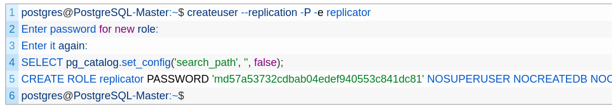
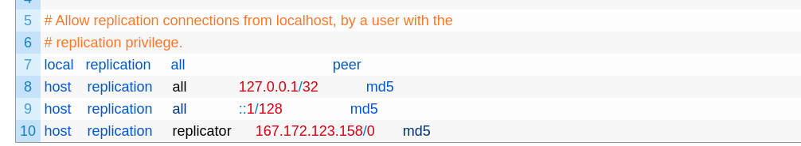

# How to stup Replication in POSTGRESQL (12)

### 1. Requirements: 
    1. Two Machines.
    2. POSTGRESQL  installed on both machines.
    3. Updated terminal.

### 2. Steps : 

#### A. On Master Machine :
1. Become postgres user :
`sudo su - postgres`
2. Enter :
`psql`
3. Enter : 
`ALTER SYSTEM SET listen_addresses TO '*';`

4. Return back to postgres user : ctrl + d.
5. Create user  with replication property then it will ask you to enter password by the command : 
`createuser --replication -P -e <name_for_replication_user>`

6. Edit pg_hba.conf file :
` nano /etc/postgresql/12/main/pg_hba.conf`
7. Head to privilege at the bottom, then add this line :

    `host    replication     name_for_replication_user      <slave_machine_ip>/0       md5`

8. Restart your postgresql service : 
`systemctl reload postgresql.service`

#### B. Slave (Standby) Machine:
1. Stop postgresql service : 
`sudo systemctl stop postgresql.service`
2. Copy your database data to someLocation in case if you want your old data, because in case of replication , we must empty our database .
become postgres user then enter :
`cp -R /var/lib/postgresql/12/main /var/lib/postgresql/12/<some_location>`

3. After moving your data, remove your database data :

`rm -rf /var/lib/postgresql/12/main/*`

4. Do the replication by : 
`pg_basebackup -h <master_machine_ip> -D /var/lib/postgresql/12/main -U <name_for_replication_user> -P -v -R -X stream -C -S node2`

For reference : [Replication Steps](https://minervadb.xyz/step-by-step-postgresql-12-streaming-replication-on-ubuntu/)

    